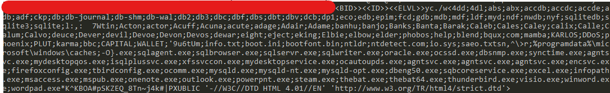
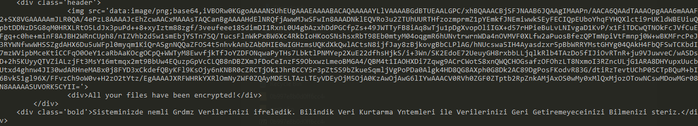

# Configuration Extractor for Phobos Ransomware

## Usage
```py
python3 Phobos_Config_Extractor.py <PhobosRansomwareSample>
```
### Example Output:
#### Files, Extensions to encrypt, processes to kill etc.


#### Preview of Turkish ransom note:



#### Note: This configuration extractor has only been tested on versions 2.9 and 2.9.1 of Phobos
